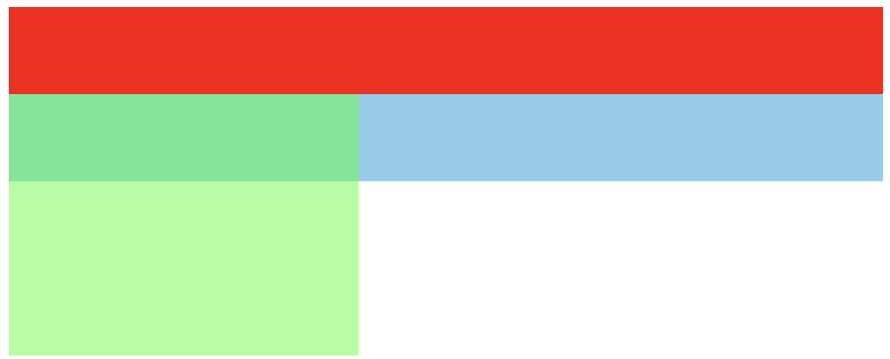
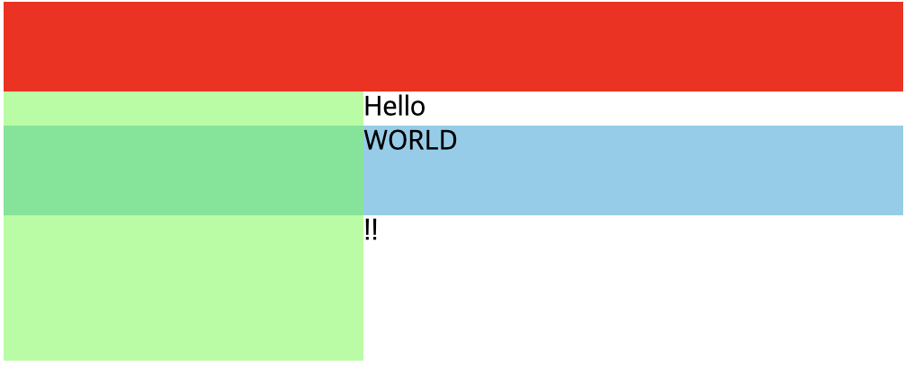
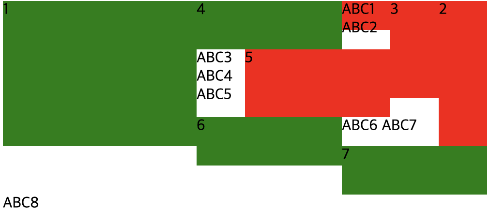
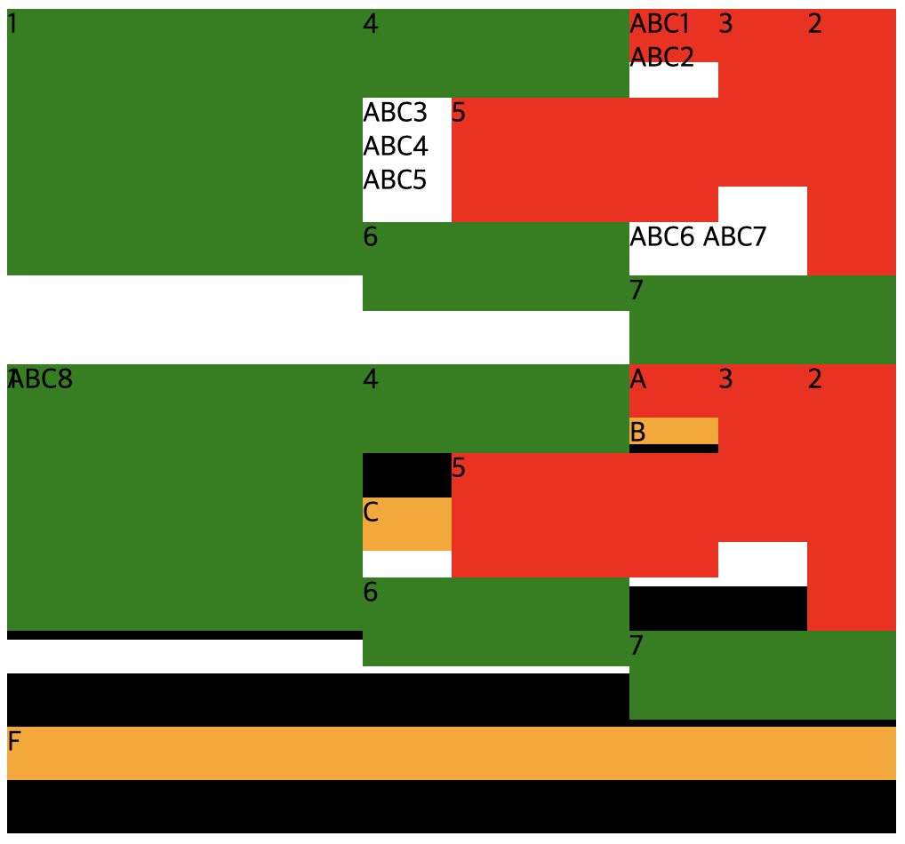

# Graphics System

[코드스피츠](https://www.youtube.com/channel/UCKXBpFPbho1tp-Ntlfc25kA)
채널에서 보고 정리한 글입니다.

---

## Fixed number

- 고정되어 있는 fixed number 는 환경에 대해 대응 할 수 없다.
- 환경적인 요인
    - Screen size
    - Chrome size
    - Hierarchy

## Abstract Calcuator

- `메타포`를 사용 ( 계산식, 함수)
    - ex) %, bock, left, inline = 함수이다.

## Component

- ex) html,의 구성 하나하나를 component

## Framework

- html 자체를  프레임워크로 볼 수 있다.
- 일정한 규칙과 사용하는 방법이 구현되어 있다.

---

# Rendering System - Dom 과 무관하다.

- 어떠한 데이터로 그림으로 표현되는 것
1. Geometry Calculate 
    - 구역을 나누는 것
    - `reflow`
2. Fragment Fill
    - 컴포넌트를 채워넣는 것
    - `repaint`

---

# Css specifications

> Css 는 버전이 아니라 `level` 로 표현

- Css level 1 - a4 한장 짜리 사양
- Css level 2 - 관심 분야 별로 Module - ms 가 거의 지배
- Css level 2.1 - Include level 3 Module 각 모듈별로 level 이 다르다.
- Module level - 새로운 모듈들도 생겨나고 각 모듈 별로 level 이 다르다.

## Other specifications

> w3 community and business group

현재 W3 에서 만 권고 사양을 봐야 되는 게 아니라 여러 그룹도 확인해야 한다. 이제는 w3 draft 가 아니더라도 각 그룹에 drart 로 지정하고 spec 을 사용하게 된다. crome

- Wicg - web platform incubator community group - google
- Ricg - Responsive issues community group

---

> 서양의 학문의 용어는 전부 고유 명사이다.(일반 명사를 고유명사로 만들어 버린다.) 고유명사는 한국어로 번역이 안된다.

# Normal Flow

> Css2.1 Visual formatting model - positioning schemes & normal flow

어떻게 화면에 보이는 것을 모델링 할 것인가?

## Position

- **`static` | `relative`** | ~~absolute | fixed | inherit~~
- 2가지 만 Normal Flow

## Normal flow

> 2가지 계산 공식으로 설명된다. Normal Flow에 만 자동으로 계산이 적용된다.

- `Block Formatting contexts` - `BFC`
    - `부모`의 가로의 `한 줄`을 다 차지 하는 행위 (부모 만큼)
    - x =0 , width =는 부모의 크기?
    - 다음 번 블록이 나올 때 y 자리 가 어디인지 만 고민 하면 된다.
    - width 지정은 화면의 그리는 Geometry의  Fragment를 지정하는 것이지 공간은 한 줄을 차지한다.
- `Inline Formatting Contexts` - `IFC`
    - `나의` 컨텐츠 크기만큼 `가로`를 차지 한다.
    - x = 첫번째 크기만큼 , inline 요소의 width 의 합이 부모 width 를 넘어가면 다음 행으로 넘어 간다.
    - 얼만큼 내려 가나?
        - inline를 구성하는 구성 중 lineheight 가 가장 큰 값 기준으로 다음 행으로 넘어간다.
    - Block 요소를 집어 넣으면 새로운 BFC 영역으로 간주 된다.
    - 공백문자를 넣어주지 않으면 하나의 인라인으로 본다.
    - ex) 
 aaaaaaaaaaaaaaaaaa 

    - word break 를 넣어 주면 하나의 span 태그로 본다.
    - word break 를 주면 느려진다.
        - 문자 하나하나를 inline로 본다.
        - Geometry 로 구역이 나눠 진다.
- Relative Positioning - position에 속해 있다.
    - 모든 element 는 default 가 position static 이다.
    - Relative 는 static 먼저 그리고 상대 적으로 이동하는 것을 의미한다.
    - static 과 Relative 를 만나면 Relative 가 z-index가 뜬다. (위로 차지 한다.)
        - 실제로 Geometry 가 변경되는 건 아니다. 그림만 해당 위치에 그려진 것이다.

---

# Float

Left | Right | None | Inherit

- `new BFC` (새로운 영역이 생긴다.)
- `Float over normal Flow` (`normal Flow 위에 그려진다.`)

    <!DOCTYPE html>
    <html lang="en">
    <head>
        <meta charset="UTF-8"/>
        <title>Title</title>
    </head>
    <body>
    

        

        

        

    

    </body>
    </html>

- Text, `Inline Guard`(text와 inline 요소에 대해서 Guard 된다.)

    <!DOCTYPE html>
    <html lang="en">
    <head>
        <meta charset="UTF-8"/>
        <title>Title</title>
    </head>
    <body>
    

        

        

        Hello
        
WORLD

        !!
    

    </body>
    </html>

- Line Box
    - Float 는 Line Box공식으로 그려진다.
    - Normal Flow 는 BFC, IFC, Relative positioning 으로 그려진다.
    - Float 가 차지 해 있으면 가용 가능 한 Line Box 의 영역은 줄어 든다.
    - LineBox 가 다 차지 하면 남아 있는 Line Box의 (가장 가까운)하단을 기준으로 Line Box 가 된다.
    - inline 과 text는  normal flow BFC 영역(float의 BFC 가 겹침)이 지정되면 남은 line box 에 차지 한다.
    - base line 기준으로 가능 한 범위 내에 float 가 위치하게 된다.
    - Text, line Guard 만 적용 될분 Geometry 는 존재 하지 않는다.( 그냥 bfc 한줄만 존재하고 글자만 line Guard 규칙에 의해서 그려진다.
    - (마지막 ABC8은 7이 float: left 이기 때문에 왼쪽으로는 그리지 못한다.)

    

        <!DOCTYPE html>
        <html lang="en">
        <head>
            <meta charset="UTF-8"/>
            <title>Title</title>
        </head>
        
        <body>
        

            
1

            
2

            
3

            
4

            
5

            
6

            
7

            
ABC1 ABC2 ABC3 ABC4 ABC5 ABC6 ABC7 ABC8

        

        </body>
        </html>

## OverFlow

Css2.1 Visual formatting model 

Visible | **Hidden** | **Scroll**  | Inherit | Auto(default) 

- **Hidden, Scroll 만 Flow 와 관련이 있다.**
    - New BFC
    - Fist Line Box Bound ( 라인박스의 크기를 고려해서 BFC 가 생성된다.)
        - 원래는 라인박스를 무시 하고 부모의 크기만큼 width 를 차지 한다.
        - 라인박스의 경계가 없으면 new BFC 의 width 는  0 이 된다.

        

            <!DOCTYPE html>
            <html lang="en">
            <head>
                <meta charset="UTF-8"/>
                <title>Title</title>
            </head>
            
            <body>
            

                
1

                
2

                
3

                
4

                
5

                
6

                
7

                
ABC1 ABC2 ABC3 ABC4 ABC5 ABC6 ABC7 ABC8

            

            

                
1

                
2

                
3

                
4

                
5

                
6

                
7

                
A

                
B

                

                
C

                
D

                

                
E

                

                
F

                

            

            </body>
            </html>

## OverFlow-x, -y

overflow module level3 draft

Visible | Hidden | Scroll  | clip | Auto(default) 

## Text - OverFlow

Css2.1 Ui module level3

clip | ellipsis

## 현재까지 고전 레이아웃

충분한 연습이 필요 하다.