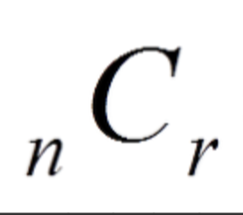

# [JAVA]-조합(Combination)

## TMI

[코딩테스트와 실무 역량 모두 잡는 알고리즘 스터디(Java) 2기 | 프로그래머스](https://programmers.co.kr/learn/courses/10004)

시작부터 TMI 가 시작된다. 프로그래머스에서 진행하는 코딩테스트-JAVA 를 온라인 스터디 진행하면서 배운 내용을 정리 한다. 

[알고리즘 연습 - 소수 만들기 | 프로그래머스](https://school.programmers.co.kr/courses/10022/lessons/58131)

내가 풀었던 문제 중 소수 만들기 문제를 풀면서 조합을 만들기 위해 Picker 클래스를 만들게 되었다. 피드백을 받아 제네릭을 사용하여 범용성있는 클래스를 구성해보았다.

## n개중 r개를 선택하는 방법의 수

> 예시

- int[] numbers = {1,2,3};
- 집합에서 2개의 조합을 구하는 경우 (순서x, 중복x)
- [[1, 2], [1, 3], [2, 3]]

- 순서나 중복을 허용했다면

    [[1,2],[1,3],[2,1],[2,3],[3,1],[3,2]] 가 될것이다.(하지만 조합은 순서x 중복x )

## 조합 점화식

1. 선택하여 뽑은 경우 [n-1 C r-1]

    > ex) 1을 뽑은경우 , 전체 갯수, 뽑아야 될 숫자 각각 1씩 감소, n개에서 1개를 뽑혔기 때문에 n-1 개중에서 현재 index를 선택한 경우 r-1 (선택,뽑을 수 있는 갯수)

2. 선택하지 않고 뽑지 않은 경우 [n-1 C r]

    > ex) 이전에 1을 뽑지 않은경우, 전체 갯, n개에서 1개를 뽑혔기 때문에 n-1 개중에서 현재 index를 선택하지 않았을 경우 r(선택,뽑을 수 있는 갯수)

- n개중 r를 선택하는 조합: 1의 경우와 2의 경우 (경우의 수:합의 법칙)

## 소스코드 (Picker 클래스 설명)

- 필드

        private T[] array; //제네릭 타입
        private List<Set<T>> selectedCombinationList; // 반환할 리스트
        //ex) [[1, 2], [1, 3], [2, 3]]

- getSelectedCombinationList()

          List<Set<T>> getSelectedCombinationList(selecteCount) {
              Stack<T> selectedNumber = new Stack<>();
              doCombination(array.length, selecteCount, 0, selectedNumber);
              return selectedCombinationList;
          }
    - 조합 리스트를 반환하는 메소드
    - `int selecteCount` 를 입력 받아 몇 개 선택할지 인자로 받는다.
    - doCombination() 를 실행하여 조합을 만든다.

- doCombination()

        private void doCombination(int totalCount, int selecteCount, int index, Stack<T> selectedNumber) {
            Stack<T> stackOfSelectValue = new Stack<>();
            stackOfSelectValue.addAll(selectedNumber);
        
            if (selecteCount == 0) {
                addSelectedValueList(selectedNumber);
            } else if (totalCount == selecteCount) {
                for (int i = 0; i < totalCount; i++) {
                    selectedNumber.add(array[index + i]);
                }
                addSelectedValueList(selectedNumber);
            } else {
                stackOfSelectValue.add(array[index]);
                doCombination(totalCount - 1, selecteCount - 1, index + 1, stackOfSelectValue);
        
                stackOfSelectValue.pop();
                doCombination(totalCount - 1, selecteCount, index + 1, stackOfSelectValue);
            }
        }

    - 재귀 함수
    - `if (selecteCount == 0)` 더이상 뽑을 수가 없는 경우
    - `else if (totalCount == selecteCount)` 모두 선택할 경우
    - `else` 일반 적인 경우 (재귀 실행할 구문)
        1. 선택할 경우
        2. 선택하지 않을 경우

        

### 전체 소스코드

    class Picker<T> {
        private T[] array;
        private List<Set<T>> selectedCombinationList;
    
        Picker(T[] array) {
            this.array = array;
            selectedCombinationList = new ArrayList<>();
        }
    
        List<Set<T>> getSelectedCombinationList(int selecteCount) {
            Stack<T> selectedNumber = new Stack<>();
            doCombination(array.length, selecteCount, 0, selectedNumber);
            return selectedCombinationList;
        }
    
        private void addSelectedValueList(Stack<T> selectedNumber) {
            Set<T> selectedNumbers = new HashSet<>(selectedNumber);
            selectedCombinationList.add(selectedNumbers);
        }
    
        private void doCombination(int totalCount, int selecteCount, int index, Stack<T> selectedNumber) {
            Stack<T> stackOfSelectValue = new Stack<>();
            stackOfSelectValue.addAll(selectedNumber);
    
            if (selecteCount == 0) {
                addSelectedValueList(selectedNumber);
            } else if (totalCount == selecteCount) {
                for (int i = 0; i < totalCount; i++) {
                    selectedNumber.add(array[index + i]);
                }
                addSelectedValueList(selectedNumber);
            } else {
                stackOfSelectValue.add(array[index]);
                doCombination(totalCount - 1, selecteCount - 1, index + 1, stackOfSelectValue);
    
                stackOfSelectValue.pop();
                doCombination(totalCount - 1, selecteCount, index + 1, stackOfSelectValue);
            }
        }
    }

### Picker 클래스 사용법

    int[] nums = {1, 2, 3};
    Integer[] numbers = Arrays.stream(nums).boxed().toArray(Integer[]::new);
    List<Set<Integer>> combinationNumberList = new Picker<>(numbers).getSelectedCombinationList(2);

## PS

- `int[] nums` 가 아닌 `String[] name` 와 같이 제네릭타입을 지정하여 여러 타입의 Array 의 조합을 만들수 있게 Pciker 클래스를 작성하였습니다.
- 조합을 만드는 클래스를 만들어 보았으니 다음은 순열을 만들어 주는 클래스를 만들어 보겠습니다. (조합과 매우 유사합니다.)
- `List<Set<T>> getSelectedCombinationList(int selecteCount)` 의 반환타입이 `List<Set<T>>` Set in List 인데 반환 타입은 원하는 대로 변경을 해도 괜찮을 것 같다. List in List 를 피하기 위해 Set<T> 로 하였지만 array in List 형식으로 해도 괜찮을 것 같다는 생각을 했다. ex) List<Integer[]>

---

참고 사이트

[자바로 만드는 조합(Combination) 알고리즘](https://bumbums.tistory.com/2)

[[Algorithm] JAVA로 중복이 없고, 순서도 없는 조합(Combination) 구하기!](https://limkydev.tistory.com/156)